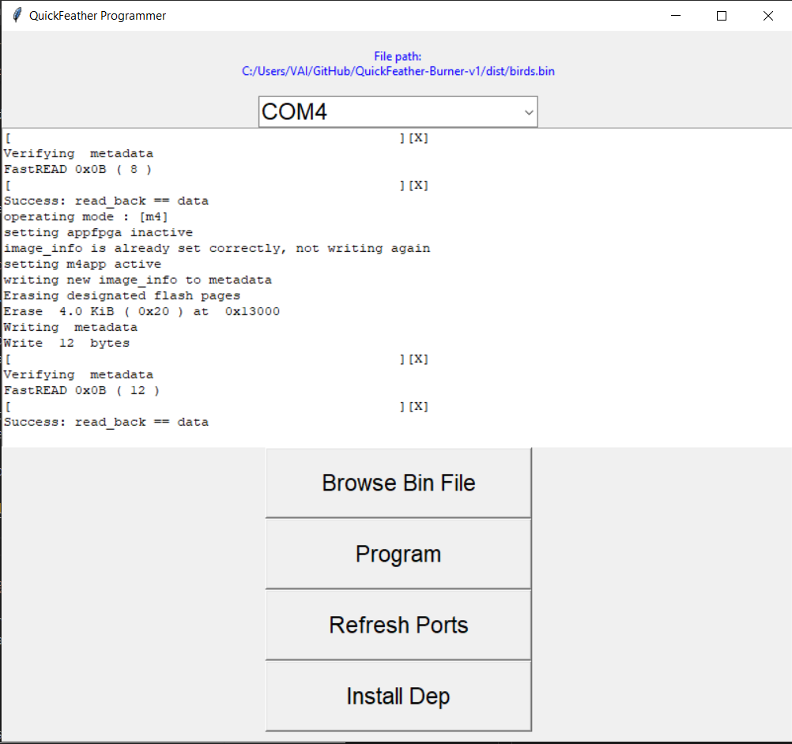
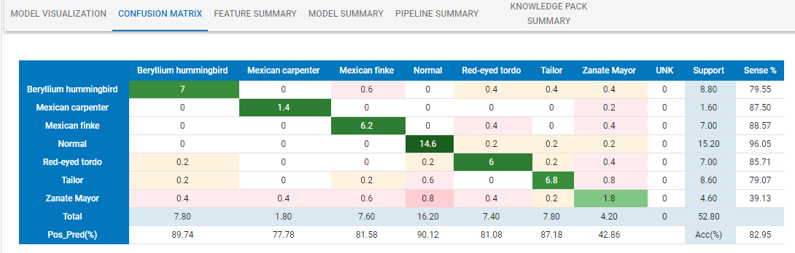

# Near-Extinct Bird Detector

# Table of Contents:
 
- [Near-Extinct Bird Detector](#near-extinct-bird-detector)
- [Table of Contents:](#table-of-contents)
- [Introduction:](#introduction)
- [Solution:](#solution)
  - [Features:](#features)
- [Hardware, Software and Services:](#hardware-software-and-services)
  - [Hardware:](#hardware)
  - [Software:](#software)
  - [Services:](#services)
- [Connection Diagram:](#connection-diagram)
  - [Backend:](#backend)
  - [Hardware:](#hardware-1)
- [Dev Environment Setup:](#dev-environment-setup)
- [QuickFeather Burner v1 (Flasher):](#quickfeather-burner-v1-flasher)
- [Capture Data:](#capture-data)
      - [**Data**: (La pagina esta en español asi que les dejo la version traducida por google translate)](#data-la-pagina-esta-en-español-asi-que-les-dejo-la-version-traducida-por-google-translate)
  - [**Setup Quickfeather**:](#setup-quickfeather)
  - [**Capturing Data**:](#capturing-data)
  - [**Labeling Data**:](#labeling-data)
- [SensiML:](#sensiml)
- [Testing Model:](#testing-model)
      - [Video Demo: Click on the image](#video-demo-click-on-the-image)
- [ESP32 Interface:](#esp32-interface)
- [Simple-Streaming-Gateway:](#simple-streaming-gateway)
  - [**SSG to AWS IoT**:](#ssg-to-aws-iot)
- [WebPage Deploy:](#webpage-deploy)
  - [AWS Cognito:](#aws-cognito)
  - [AWS IoT WebSocket:](#aws-iot-websocket)
  - [Data Post Processing:](#data-post-processing)
- [Final Product:](#final-product)
- [EPIC DEMO:](#epic-demo)

# Introduction:

Because of illegal hunting and sporting hunt, there are several near-extinct bird species that could be saved with technological solutions.

The current discussion [1] according to Nature, is how much of this extinction of species can be mitigated if action is taken to avoid it, reinforced by Birdlife [2], and it approximates a 40% mitigation.

Similar solutions that i found are based on raising awareness of the problem. Ignoring those solutions, i can find:

* Use of necklaces with GPS.
Disadvantages: collars and sensors that go on an animal can cause damage or discomfort to the animal. In the case of batteries, they can explode.

    https://www.gps-collars.com/

* Smart sensing with Drones.
Disadvantages: They can generate unexpected collisions or collapses against animals and injure them.

    https://upcommons.upc.edu/bitstream/handle/2117/104909/Survey-an-welfare-arxiv.pdf

* Identification of bird’s songs.
Disadvantages: complex and cumbersome system which can be difficult to maintain for a long time in one place.

    https://phys.org/news/2012-05-technology-bird.html

In the case of the latter, in addition to strengthening our theory, it gives us the opportunity to make an easily reproducible, energy efficient and powerful system.

1. https://natureecoevocommunity.nature.com/posts/how-many-bird-and-mammal-extinctions-has-recent-conservation-action-prevented

2. https://www.birdlife.org/worldwide/news/new-study-conservation-action-has-reduced-bird-extinction-rates-40

# Solution:

Using the Infineon IM69D130 PDM digital microphone included in the QuickFeather Development Kit we will obtain an audio signal which, using SensiML, we can pass through a neural network, which indicates the type of bird we are hearing.

Displaying the information of the birds detected in a simple webapp.

## Features:

* High accuracy (thanks to sensiml).
* Easy production at large scale, due to its simplicity.

# Hardware, Software and Services:

## Hardware:

* QuickFeather Development Kit. 1x.
  * https://www.quicklogic.com/products/eos-s3/quickfeather-development-kit/
* ESP32. 1x
  * https://www.adafruit.com/product/3405
* 5v Source and USB to MicroUSB cable. 2x.
  * https://www.amazon.com/dp/B07QX1Q4J7/ref=cm_sw_em_r_mt_dp_NFAEN603J65DF0FFPXJH
* Raspberry Pi Zero W.
  * https://www.amazon.com/dp/B072LWBL37/ref=cm_sw_em_r_mt_dp_KX7BR35A9H5MJ4EMGWBK?_encoding=UTF8&psc=1

## Software:

* SensiML.
  * https://sensiml.com/
* Data capture lab.
  * https://sensiml.com/products/data-capture-lab/
* Python.
  * https://www.python.org/
* ReactJS.
  * https://reactjs.org/
* Raspberry Pi OS.
  * https://www.raspberrypi.org/software/
* Qorc SDK.
  * https://github.com/QuickLogic-Corp/qorc-sdk/
* Zephyr RTOS.
  * https://www.zephyrproject.org/

## Services:

* Docker.
  * https://www.docker.com/
* AWS IoT.
  * https://aws.amazon.com/iot/
* AWS S3.
  * https://aws.amazon.com/s3/
* Simple-Streaming-Gateway
  * https://sensiml.com/documentation/simple-streaming-specification/simple-wifi-streaming.html

# Connection Diagram:

## Backend:

## Hardware:

QuickFeather as AI Shield for ESP32.

# Dev Environment Setup:

Since I use my computer to program many different components, I really like being able to isolate the environments that I use to program. In this case to carry out the development of the application and to be able to use the Qorc SDK correctly, I installed everything in one container which could simply be turned on and off to compile the programs. In addition to being easily reproducible on different machines.

I have uploaded the container to Docker Hub so you can use it too if you want.

Zelda: https://hub.docker.com/r/altaga/symbiflow-ql

Here is a sample of the container compiling the sample program of qf_ssi_ai_app

# QuickFeather Burner v1 (Flasher):

In addition to compiling everything into development ENV on a docker, I decided to create a GUI to easily program QuickFeather without the need for a command line.

The program is compatible with Windows 10 and you can find the executable in the QuickFeather Burner v1 folder

Otherwise you can see the code for this in the repository.

https://github.com/altaga/QuickFeather-Burner-v1

- Requisitos previos, tener python3 instalado en la pc y disponible en PATH.

- **Install Dep**: The first time you open it, press the button to install the program's dependencies.
- **Refresh Ports**: Refresh the serial ports connected to the pc.
- **Browse Bin File**: Searches the file in the bin.
- **Program**: Program the bin on the selected device, once you finish flashing the device you should see a "success" response.

Video Demo: Click on the image

The function of this program is purely to speed up the flash process of the device from the command line.

# Capture Data:

In order to have a reliable data of the bird songs of my country and to be able to carry out a correct test of the device, It was decided to use the songs of this "database" as input for the training of the model.

#### **Data**: (The web page is in Spanish so I leave the version translated by google translate)
https://translate.google.com/translate?sl=es&tl=en&u=https://www.biodiversidad.gob.mx/cienciaciudadana/cantos_aves_cdmx

For this test I decided to use the data from the following 6 random birds.

* Beryllium hummingbird
* Mexican carpenter
* Mexican finke
* Red-eyed tordo
* Tailor
* Zanate Mayor 

If you want to go deeper into the project, it is in the Data Capture Lab Project folder.

## **Setup Quickfeather**:

To setup the device and to be able to sample my audios using QuickFeather, I followed the official SensiML tutorial.

Working with Audio Data
using QuickFeather and SensiML
https://sensiml.com/blog/tutorial-series/#

In this case, since the device will work through WiFi, I decided to use the ESP32 interface offered by SensiML to send all the data through WiFi. More details in:
[ESP32 Interface](#esp32-interface)

https://github.com/sensiml/esp32_simple_http_uart

Particularly if you want to review the project and compile it yourself, it will be in the folder. Data Capture Lab

If you just want to start taking measurements from your device, the compiled bin will be in the folder. Data Capture Lab Bin

Video Demo: Click on the image

## **Capturing Data**:

To sample the data, take the audios provided by the [Webpage](#data) and capture them with the QuickFeather.

## **Labeling Data**:

For data labeling, in each frame of captured data, select the most significant segments of the bird songs and also select the segments where they did not sing to have the Normal category (where there are no bird songs, pure noise from the background nature, in this case "silence")

Here is an example of the song of the Mexican carpenter:

# SensiML:

In this case, when training the model, use the following settings, since they were the ones that gave me the best results.

The confusion matrix resulting from the generated model was:

The results of the recognition of the 6 birds were:

Due to the limitations of the microcontroller, it is necessary to ensure that there are few birds to be detected by the microcontroller.

# Testing Model:

Testing the model with some of the birds using the [ESP32 Interface](#esp32-interface) y [Simple-Streaming-Gateway](#simple-streaming-gateway).

Video Demo: Click on the image

Although it seems that the model detects multiple birds without sense, it is actually detecting mostly the bird that we want. However, to demonstrate this, we have to average several detections to show how it detects the bird correctly.

This is a demo with the final platform, detecting one of the birds. This averaging process will be explained in the section [Webpage](#webpage-deploy).

#### Video Demo: Click on the image

# ESP32 Interface:

This ESP32 interface is explained in the SensiML video series.

https://sensiml.com/blog/tutorial-series/
Connecting QF and Data Capture Lab over WiFi
A configuration guide utilizing the ESP32

All the code for this ESP32 project is in the esp32_simple_http_uart folder, to compile it and flash it on ESP32 you have to use the ESP-IDF vscode add-on.

https://docs.espressif.com/projects/esp-idf/en/latest/esp32/get-started/vscode-setup.html

The only setup that this project requires is the following.

In line 135 of esp32_simple_http_uart / sdkconfig put your wifi credentials and compile the code.

    CONFIG_EXAMPLE_CONNECT_WIFI=y
    # CONFIG_EXAMPLE_CONNECT_ETHERNET is not set
    CONFIG_EXAMPLE_WIFI_SSID="YOURSSID"
    CONFIG_EXAMPLE_WIFI_PASSWORD="YOURPASS"
    CONFIG_EXAMPLE_CONNECT_IPV6=y
    # end of Example Connection Configuration

Once this is done you can connect it to the Simple-Streaming-Gateway without problem.

# Simple-Streaming-Gateway:

In order to review what our QuickFeather is reading, install the SSG example provided by SensiML.

https://github.com/sensiml/open-gateway

In order to leave the system installed and not have to run SSG on a computer, I decided to install it completely on a RaspberryPi Zero W

Aqui se ve la plataforma.

## **SSG to AWS IoT**:

In this case, in order to communicate our device to AWS IoT, I decided to modify the SSG code a bit in order to implement an MQTT connection to AWS IoT, we will take advantage of the fact that the SSG uses a Python backend to work.

The file to modify in the SSG was Simple-Streaming-Gateway/sources/base.py

An MQTT Broker for AWSIoT was added.

*Add your AWSIoT endpoint and the topic to which you will send the data.

EndPoint = "XXXXXXXXXXXXXXX.iot.us-east-1.amazonaws.com"
sub_topic = 'birds-detected'

Due to AWS security, it is necessary to create a client certificate and a private certificate, in order to communicate the device to the platform.

- First we have to access our AWS console and look for the IoT core service:

- Obtain your AWS endpoint, save it.

- In the lateral panel select the "Onboard" option and then "Get started".

- Select "Get started".

- At "Choose a platform" select "Linux/OSX", in AWS IoT DEvice SDK select "Python" and then click "Next".

- At Name, write any name, then click on "Next step".

- At "Download connection kit for" press the button "Linux/OSX" to download the credential package (which we will use later) and click on "Next Step".

- Click "Done".

- Click "Done".

- On the lateral bar, inside the Manage/Things section we can see our thing already created. Now we have to set up the policy of that thing for it to work without restrictions in AWS.

- At the lateral bar, in the Secure/Policies section we can see our thing-policy, click on it to modify it:

- Click on "Edit policy document".

Copy-paste the following text in the document and save it.

    {
    "Version": "2012-10-17",
    "Statement": [
        {
        "Effect": "Allow",
        "Action": "iot:*",
        "Resource": "*"
        }
    ]
    }

With this, the device will send the data to AWS IoT.

# WebPage Deploy:

The deployment of the web page was done using ReactJS and AWS-SDK for javascript.

https://near-extinct-bird-detector.s3.amazonaws.com/index.html

## AWS Cognito:

For security, to safely use and consume AWS services, **identity pool** credentials were implemented with the Cognito service.

The access keys for AWSIoT and Cognito must be placed in the following file.

Webapp/src/components/aws-configuration.js

    var awsConfiguration = {
      poolId: "us-east-1:XXXXXXXXXXXXXXX", // 'YourCognitoIdentityPoolId'
      host:"XXXXXXXXXXXXXX-ats.iot.us-east-1.amazonaws.com", // 'YourAwsIoTEndpoint', e.g. 'prefix.iot.us-east-1.amazonaws.com'
      region: "us-east-1" // 'YourAwsRegion', e.g. 'us-east-1'
    };
    module.exports = awsConfiguration;

## AWS IoT WebSocket:

The web page receives the sensor data through AWSIoT as a web socket, so it is important to define within the page, which is the topic that we are going to receive, in this case "birds-detected" as we could see in the video of [Video Demo ](#video-demo-click-on-the-image).

In the following file, put the name of the topic to which you will be subscribed.
WebApp/src/App.js

    <IotReciever sub_topics={["birds-detected"]} callback={this.callBackIoT} />

## Data Post Processing:

To post-process the data detected by the sensor, an average of 7 samples was taken. Each time the system detects that it has accumulated 7 audio samples, it obtains the statistical mode of the data to observe which of the birds was the most detected. Showing the information of this events.

    const temp = JSON.parse(IoTData[1])
      in_array.push(parseInt(temp.Classification))
      console.log(in_array)
      if (in_array.length > 6) {
        let temps = this.state.birds

        if (flag && temps.find(element => element === (statisticalMode(in_array) - 1)) === undefined && (statisticalMode(in_array) - 1) !== 3) {
          flag = false
          temps.pop()
          temps.push(statisticalMode(in_array) - 1)
          this.setState({
            birds: temps
          })
        }
        else if (temps.find(element => element === (statisticalMode(in_array) - 1)) === undefined && (statisticalMode(in_array) - 1) !== 3) {
          temps.push(statisticalMode(in_array) - 1)
          this.setState({
            birds: temps
          })
        }
        in_array = []
      
Here we can see how the platform detects one of the birds correctly.

[Video Demo](#video-demo-click-on-the-image).

# Final Product:

I deployed this project in a local forest, which fortunately has a free WiFi connection. Therefore it was possible to place the device in this place to carry out the pilot tests.

Device:

Gateway:

Device on site:

WebbApp:

https://near-extinct-bird-detector.s3.amazonaws.com/index.html

# EPIC DEMO:

