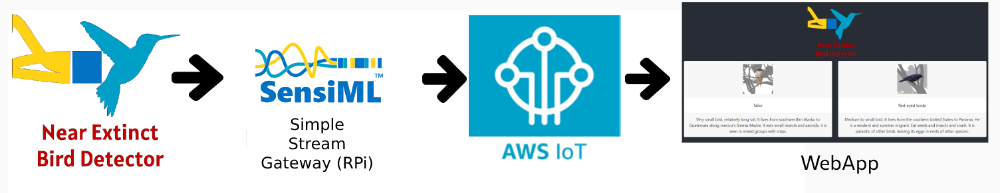
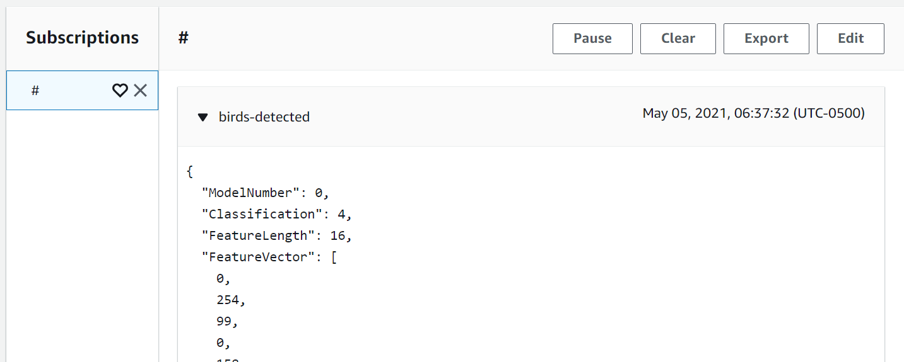

# Near-Extinct Bird Detector

# Table of Contents:
 
- [Near-Extinct Bird Detector](#near-extinct-bird-detector)
- [Table of Contents:](#table-of-contents)
- [Introduction:](#introduction)
- [Solution:](#solution)
  - [Features:](#features)
- [Hardware, Software and Services:](#hardware-software-and-services)
  - [Hardware:](#hardware)
  - [Software:](#software)
  - [Services:](#services)
- [Connection Diagram:](#connection-diagram)
  - [Backend:](#backend)
  - [Hardware:](#hardware-1)
- [Dev Environment Setup:](#dev-environment-setup)
- [QuickFeather Burner v1 (Flasher):](#quickfeather-burner-v1-flasher)
- [Capture Data:](#capture-data)
      - [**Data**: (La pagina esta en español asi que les dejo la version traducida por google translate)](#data-la-pagina-esta-en-español-asi-que-les-dejo-la-version-traducida-por-google-translate)
  - [**Setup Quickfeather**:](#setup-quickfeather)
  - [**Capturing Data**:](#capturing-data)
  - [**Labeling Data**:](#labeling-data)
- [SensiML:](#sensiml)
- [Testing Model:](#testing-model)
- [ESP32 Interface:](#esp32-interface)
- [Simple-Streaming-Gateway:](#simple-streaming-gateway)
  - [**SSG to AWS IoT**:](#ssg-to-aws-iot)
- [WebPage Deploy:](#webpage-deploy)
  - [AWS Cognito:](#aws-cognito)
  - [AWS IoT WebSocket:](#aws-iot-websocket)
- [Final Product:](#final-product)
- [EPIC DEMO:](#epic-demo)

# Introduction:

Because of illegal hunting and sporting hunt, there are several near-extinct bird species that could be saved with technological solutions.

The current discussion [1] according to Nature, is how much of this extinction of species can be mitigated if action is taken to avoid it, reinforced by Birdlife [2], and it approximates a 40% mitigation.

Similar solutions that i found are based on raising awareness of the problem. Ignoring those solutions, i can find:

* Use of necklaces with GPS.
Disadvantages: collars and sensors that go on an animal can cause damage or discomfort to the animal. In the case of batteries, they can explode.

    https://www.gps-collars.com/

* Smart sensing with Drones.
Disadvantages: They can generate unexpected collisions or collapses against animals and injure them.

    https://upcommons.upc.edu/bitstream/handle/2117/104909/Survey-an-welfare-arxiv.pdf

* Identification of bird’s songs.
Disadvantages: complex and cumbersome system which can be difficult to maintain for a long time in one place.

    https://phys.org/news/2012-05-technology-bird.html

In the case of the latter, in addition to strengthening our theory, it gives us the opportunity to make an easily reproducible, energy efficient and powerful system.

1. https://natureecoevocommunity.nature.com/posts/how-many-bird-and-mammal-extinctions-has-recent-conservation-action-prevented

2. https://www.birdlife.org/worldwide/news/new-study-conservation-action-has-reduced-bird-extinction-rates-40

# Solution:

Using the Infineon IM69D130 PDM digital microphone included in the QuickFeather Development Kit we will obtain an audio signal which, using SensiML, we can pass through a neural network, which indicates the type of bird we are hearing.

Desplegando la informacion de las aves detectectadas en una sencilla webapp.

## Features:

* High accuracy (thanks to sensiml).
* Easy production at large scale, due to its simplicity.

# Hardware, Software and Services:

## Hardware:

* QuickFeather Development Kit. 1x.
  * https://www.quicklogic.com/products/eos-s3/quickfeather-development-kit/
* ESP32. 1x
  * https://www.adafruit.com/product/3405
* 5v Source and USB to MicroUSB cable. 2x.
  * https://www.amazon.com/dp/B07QX1Q4J7/ref=cm_sw_em_r_mt_dp_NFAEN603J65DF0FFPXJH
* Raspberry Pi Zero W.
  * https://www.amazon.com/dp/B072LWBL37/ref=cm_sw_em_r_mt_dp_KX7BR35A9H5MJ4EMGWBK?_encoding=UTF8&psc=1

## Software:

* SensiML.
  * https://sensiml.com/
* Data capture lab.
  * https://sensiml.com/products/data-capture-lab/
* Python.
  * https://www.python.org/
* ReactJS.
  * https://reactjs.org/
* Raspberry Pi OS.
  * https://www.raspberrypi.org/software/
* Qorc SDK.
  * https://github.com/QuickLogic-Corp/qorc-sdk/
* Zephyr RTOS.
  * https://www.zephyrproject.org/

## Services:

* Docker.
  * https://www.docker.com/
* AWS IoT.
  * https://aws.amazon.com/iot/
* AWS S3.
  * https://aws.amazon.com/s3/
* Simple-Streaming-Gateway
  * https://sensiml.com/documentation/simple-streaming-specification/simple-wifi-streaming.html

# Connection Diagram:

## Backend:

## Hardware:

QuickFeather as AI Shield for ESP32.

# Dev Environment Setup:

Debido a que mi computadora la utilizo para realiza la programacion de muchos distintos componentes, me gusta mucho poder aislar los environments que utilizo para programar, en este caso para realizar el desarrollo de mi aplicacion y poder utilizar el Qorc SDK correctamente, instale todo en un container el cual pudiera simplemente encender y apagar para compilar los programas, ademas de reproducible facilmente en distintas maquinas.

He subido el contenedor a Docker Hub para que puedas utilizarlo tambien si lo deseas.

Zelda: https://hub.docker.com/r/altaga/symbiflow-ql

Aqui una muestra de el contenedor compilando el programa muestra de qf_ssi_ai_app

# QuickFeather Burner v1 (Flasher):

Ademas de compilar todo en ENV de desarrollo en un docker, decidi crear una GUI para programar facilmente el QuickFeather sin necesidad de linea de comandos.

El programa es compatible con Windows 10 y podras encontrar el ejecutable en la carpeta QuickFeather Burner v1

Sino puedes ver el codigo de este en el repositorio.

https://github.com/altaga/QuickFeather-Burner-v1

- Requisitos previos, tener python3 instalado en la pc y disponible en PATH.

- **Install Dep**: La primera vez que lo abras presiona el boton para instalar las dependencias del programa.
- **Refresh Ports**: Refresca los serial ports conectados a la pc.
- **Browse Bin File**: Buscar el bin a instalar en el dispositivo.
- **Program**: Programa el bin en el dispositivo seleccionado, una vez termine de flashear el dispositivo deberas ver una respuesta se success.

Video Demo: Click on the image

La funcion de este programa es puramente la de agilizar el proceso de flash del device desde la linea de comandos.

# Capture Data:

Para tener una data fiable de los cantos de aves de mi pais y poder realizar una prueba correcta del dispositivo, decidi utilizar los cantos de esta "base de datos" como input para el entrenamiento de mi modelo.

#### **Data**: (La pagina esta en español asi que les dejo la version traducida por google translate)
https://translate.google.com/translate?sl=es&tl=en&u=https://www.biodiversidad.gob.mx/cienciaciudadana/cantos_aves_cdmx

Para esta prueba decidi utilizar los datos de las siguientes 6 aves al azar.

* Beryllium hummingbird
* Mexican carpenter
* Mexican finke
* Red-eyed tordo
* Tailor
* Zanate Mayor 

Si deseas profundizar mas en el proyecto esta en la carpeta Data Capture Lab Project.

## **Setup Quickfeather**:

Para el setup de el device y poder realizar el muestreo de mis audios mediante el QuickFeather segui el tutorial oficial de SensiML.

Working with Audio Data
using QuickFeather and SensiML
https://sensiml.com/blog/tutorial-series/#

En mi caso ya que el dispositivo va funcionar mediante WiFi, decidi utilizar la interfaz de ESP32 ofrecida por SensiML para mandar todos los datos por WiFi. Mas detalles en [ESP32 Interface](#esp32-interface)

https://github.com/sensiml/esp32_simple_http_uart

Particularmente si quieres revisar el proyecto y compilarlo por ti mismo, estara en la carpeta. Data Capture Lab

Si solo quieres empezar a tomar las medidas desde tu dispositivo el bin compilado estara en la carpeta. Data Capture Lab Bin

Video Demo: Click on the image

## **Capturing Data**:

Para realizar el muestreo de los datos, tome los audios proporcionados por la [Webpage](#data) y los capture con el QuickFeather.

## **Labeling Data**:

Para el labeling de los datos, en cada trama de datos capturados, seleccione los segmentos mas significativos de los cantos de las aves y ademas seleccione los segmentos donde no cantaban para tener la categoria Normal (donde no hay cantos de aves, puro ruido de la naturaleza de fondo, en este caso "silencio")

Aqui un ejemplo de el canto de el carpintero mexicano.

# SensiML:

En este caso al entrenar al modelo utilice los siguientes settings, ya que fueron los que me dieron los mejores resultados.

La matriz de confusion resultante del modelo generado fue.

Los resultados del reconocimiento de las 6 aves fueron.

Debido a las limitaciones del microcontrolador hay que procurar que sean pocas las aves a detectar por microcontrolador.

# Testing Model:

Probando el modelo con algunas de las aves mediante el [ESP32 Interface](#esp32-interface) y [Simple-Streaming-Gateway](#simple-streaming-gateway).

Video Demo: Click on the image

Aunque parezca que el modelo detecta multiples aves sin sentido, realmente esta detectando mayormente el ave que queremos, sin embargo para demostrar esto, tenemos que sacar el promedio de varias detecciones para mostrar como si detecta el ave correctamente.

En este caso este es un demo ya con la plataforma final, detectando una de las aves, este proceso de promediado se explicara en la seccion [Webpage](#webpage-deploy).

Video Demo: Click on the image

# ESP32 Interface:

Esta interfaz de ESP32 es explicada en la serie de videos de SensiML.

https://sensiml.com/blog/tutorial-series/
Connecting QF and Data Capture Lab over WiFi
A configuration guide utilizing the ESP32

Todo el codigo de este proyecto de ESP32 esta en la carpeta esp32_simple_http_uart, para compilarlo y flash en el ESP32 tienes que utilizar el add-on de vscode de ESP-IDF.

En la linea 135 de sdkconfig, pon tus credenciales de wifi y compila el codigo.

    CONFIG_EXAMPLE_CONNECT_WIFI=y
    # CONFIG_EXAMPLE_CONNECT_ETHERNET is not set
    CONFIG_EXAMPLE_WIFI_SSID="YOURSSID"
    CONFIG_EXAMPLE_WIFI_PASSWORD="YOURPASS"
    CONFIG_EXAMPLE_CONNECT_IPV6=y
    # end of Example Connection Configuration

# Simple-Streaming-Gateway:

Para poder revisar lo que esta leyendo nuestro QuickFeather instale el ejemplo de SSG proporcionado por SensiML.

https://github.com/sensiml/open-gateway

Para poder dejar el sistema instalado y no tener que correr el SSG en una computadora, decidi instalarlo completamente en una RaspberryPi Zero W

Aqui se ve la plataforma.

## **SSG to AWS IoT**:

En este caso para poder comunicar nuestro dispositivo a AWS IoT decidi modificar un poco el codigo del SSG para poder implementar una conexion MQTT a AWS IoT, aprovecharemos que el SSG usa un backend de Python para funcionar.

El archivo a modificar en el SSG fue Simple-Streaming-Gateway/sources/base.py

Se le agrero un Broker de MQTT para AWSIoT.

* Agrega tu AWSIoT endpoint y el topic al cual mandaras los datos.

EndPoint = "XXXXXXXXXXXXXXX.iot.us-east-1.amazonaws.com"
sub_topic = 'birds-detected'

Debido a la seguridad de AWS, es necesario crear un certificado de client y uno private, para poder comunicar el device a la plataforma.

- First we have to access our AWS console y look for the IoT core service:

- Obtain your AWS endpoint, save it.

- In the lateral panel select the "Onboard" option and then "Get started".

- Select "Get started".

- At "Choose a platform" select "Linux/OSX", in AWS IoT DEvice SDK select "Python" and then click "Next".

- At Name, write any name, then click on "Next step".

- At "Download connection kit for" press the button "Linux/OSX" to download the credential package (which we will use later) and click on "Next Step".

- Click "Done".

- Click "Done".

- On the lateral bar, inside the Manage/Things section we can see our thing already created. Now we have to set up the policy of that thing for it to work without restrictions in AWS.

- At the lateral bar, in the Secure/Policies section we can see our thing-policy, click on it to modify it:

- Click on "Edit policy document".

Copy-paste the following text in the document and save it.

    {
    "Version": "2012-10-17",
    "Statement": [
        {
        "Effect": "Allow",
        "Action": "iot:*",
        "Resource": "*"
        }
    ]
    }

Ya con esto el device mandara los datos a AWS IoT.

# WebPage Deploy:

## AWS Cognito:

## AWS IoT WebSocket:

# Final Product:

# EPIC DEMO:
